# Electromagnetic Design — Ansys Maxwell 3D + Simplorer

The coil pair's electromagnetic behavior — self-inductance, mutual inductance, and coupling coefficient — was modeled in **Ansys Maxwell 3D**, then linked into **Ansys Simplorer (Twin Builder)** for circuit-level co-simulation alongside the compensation network. This is what let us extract accurate coil parameters before ever winding a physical coil, and cross-check them against the MATLAB model and bench measurements.

## Building the Coil Geometry

The transmitter coil is drawn as a parametric polyline inside a Maxwell 3D design, sketched turn-by-turn as a symmetric spiral.

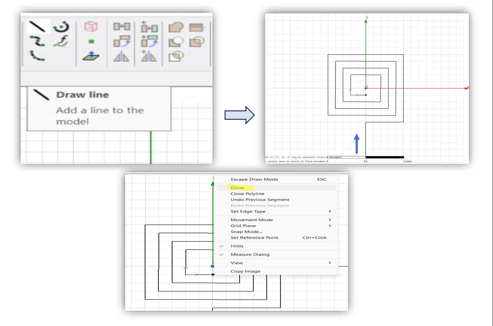

Each winding segment is given a **rectangular** cross-section rather than circular — this was a deliberate choice: a circular cross-section drastically slows down meshing and solve time in Maxwell, with no meaningful accuracy benefit for this design.

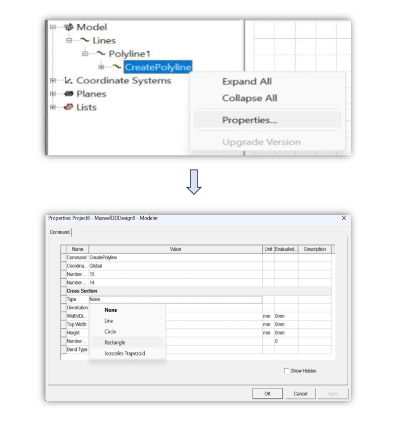

The turn's cross-sectional area (e.g. 3 mm × 3 mm) and the coil's overall length/width are tied to named design variables, so the whole coil geometry can be re-swept parametrically instead of being redrawn by hand for every design iteration.

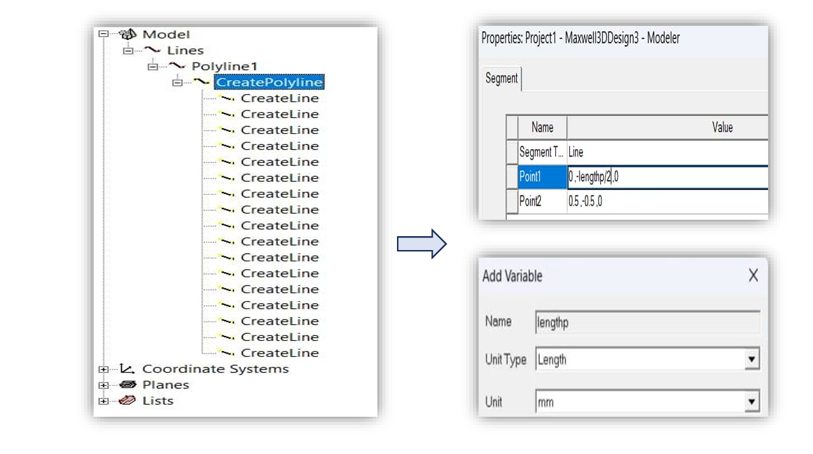

## From Transmitter to Receiver

Once the transmitter coil is finished, the receiver coil is created by copying the transmitter geometry and translating it along the Z-axis by the design air-gap variable — keeping the two coils perfectly aligned in X/Y while separating them by the intended gap distance.

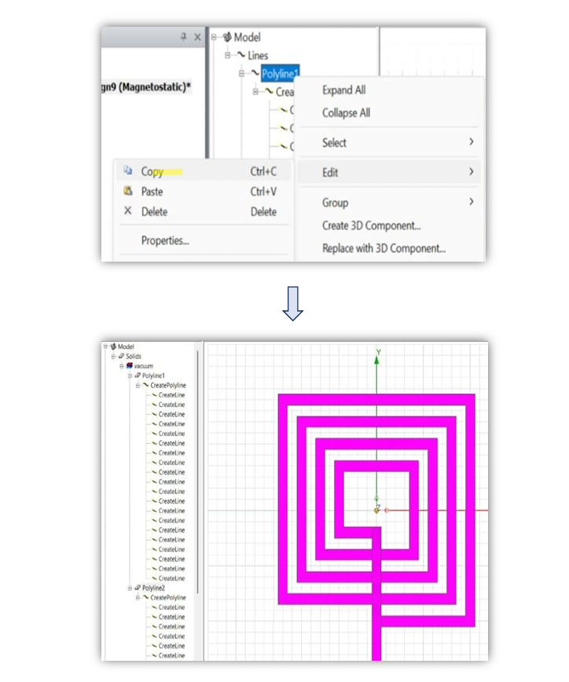

Copper is assigned as the conductor material for both windings.

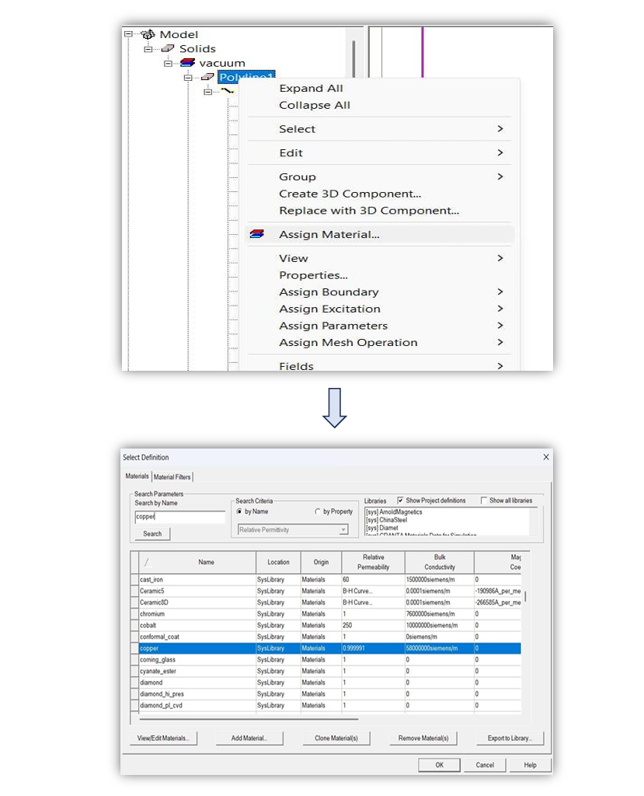

## Boundary, Excitation, and Solve Setup

The coil pair is enclosed in an air region to bound the field solution. A couple of practical lessons from this step: larger padding around the model generally improves solution accuracy, but padding should **not** be applied along the terminal axis, or the excitation geometry gets distorted.

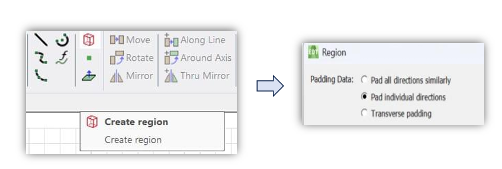

Four stranded-type current excitations are applied — one pair per coil — with the return-path currents' direction swapped so the field solver sees correct current flow around each loop.

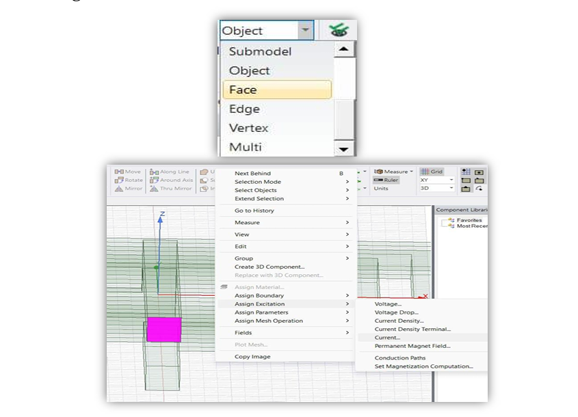

A matrix is then defined across the excitations, which is what lets Maxwell directly report self-inductance, mutual inductance, and coupling coefficient between the transmitter and receiver windings.

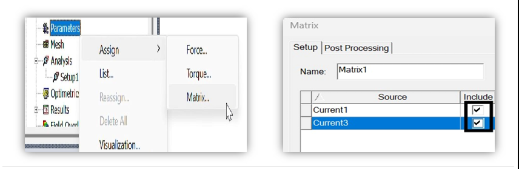

The adaptive mesh solver is configured for up to 10 passes with a 1% convergence criterion, then validated and solved.

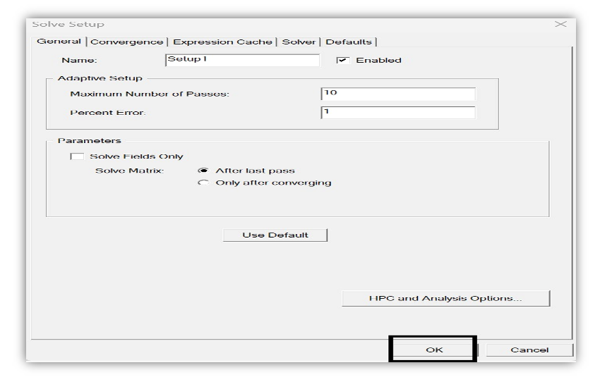
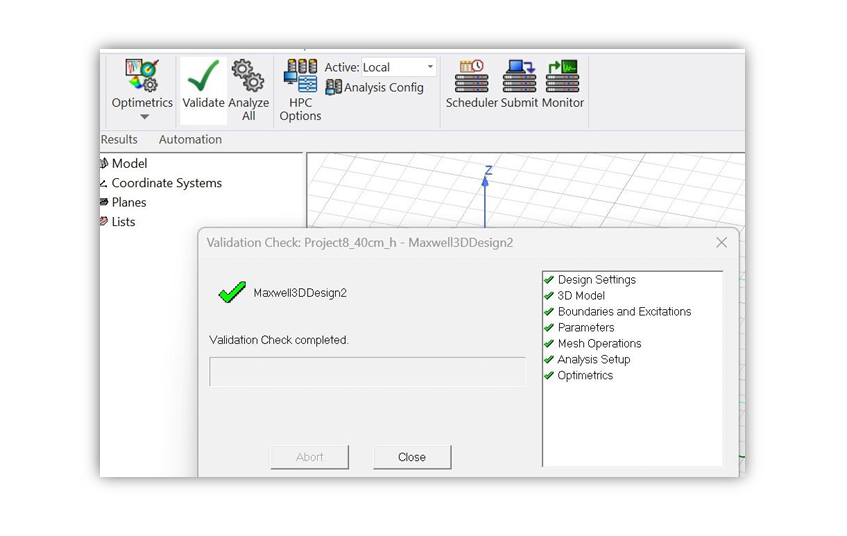

## Results

L, M, and coupling coefficient (K) are read directly from the Magnetostatic report / data table once the solve completes.

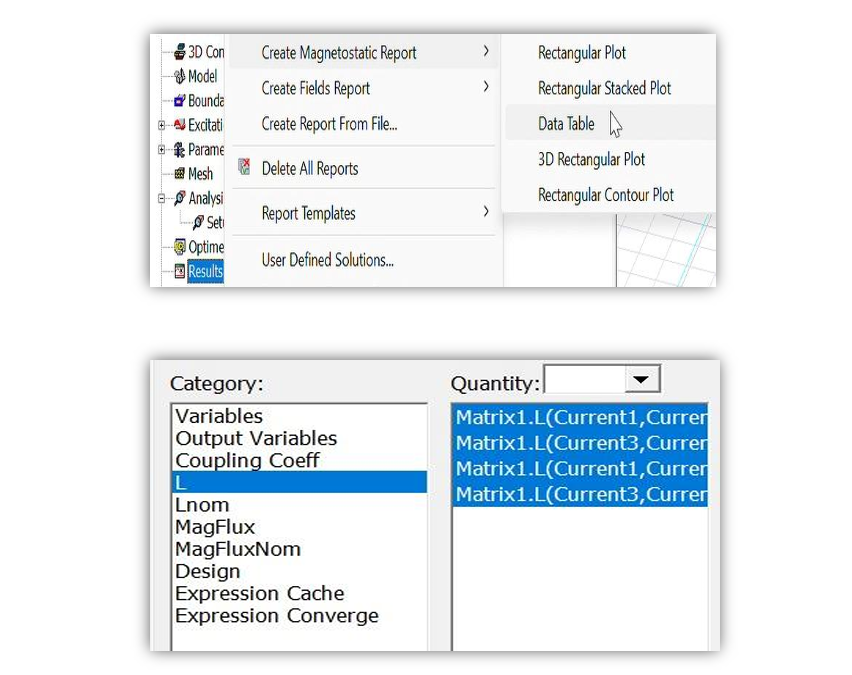

## Linking to Ansys Simplorer (Twin Builder)

To validate the Maxwell field solution against a full circuit — including the compensation network and rectifier — the design is linked into a Simplorer (Twin Builder) schematic.

A **Dynamic Magnetostatic** component is added, which references the Maxwell coil model directly as a circuit element. It's wired alongside the primary/secondary compensation R-C networks and voltage probes on each side. The imported block needs to be rotated and flipped before it lines up correctly with the rest of the schematic.

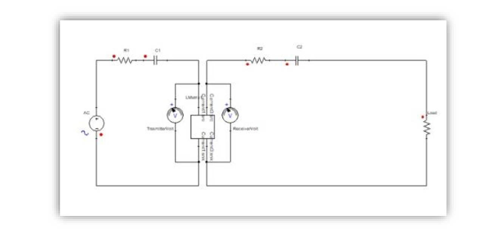

A transient solve is configured (500 ms end time, 10 ns minimum / 1 µs maximum time step), then standard rectangular plots are generated from the results.

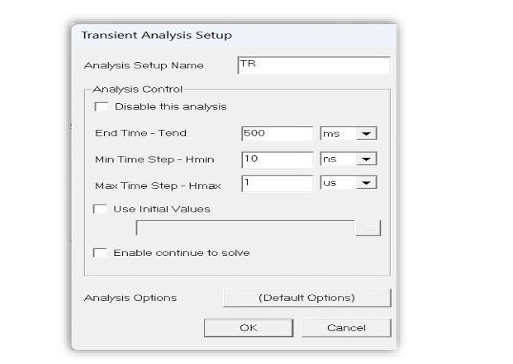
