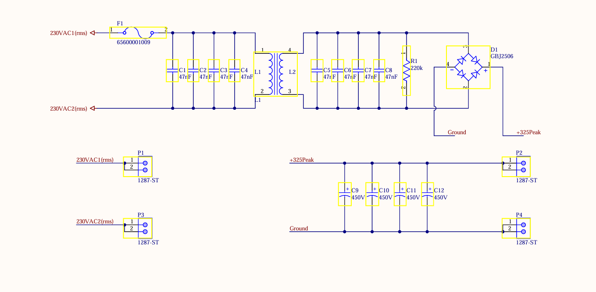
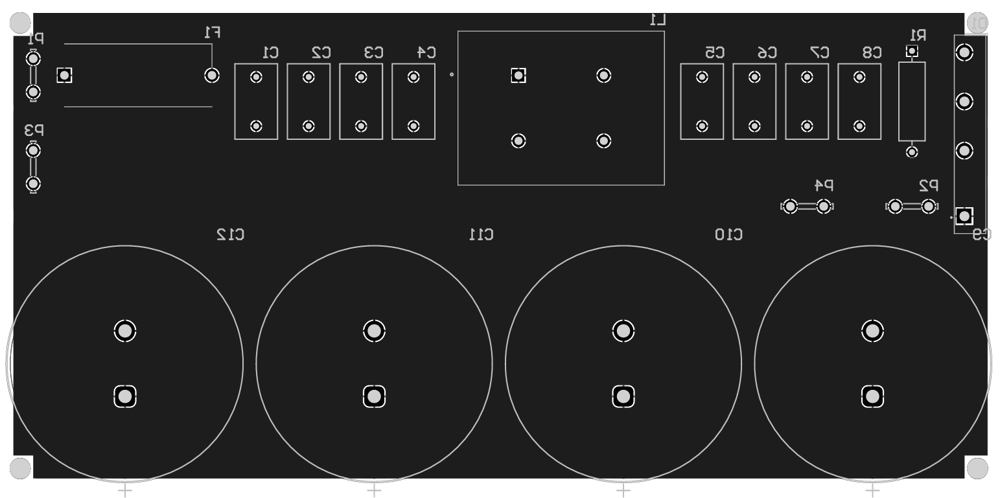
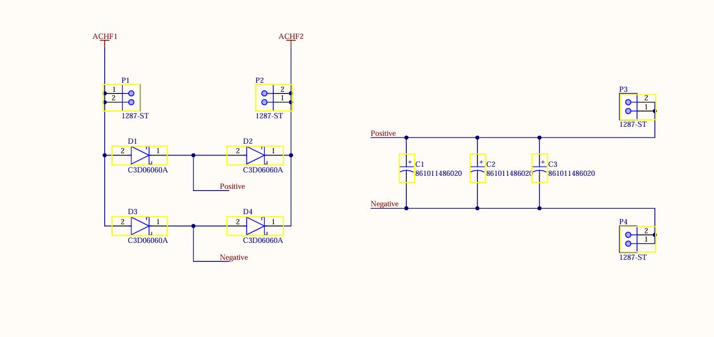
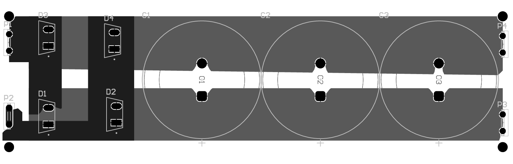
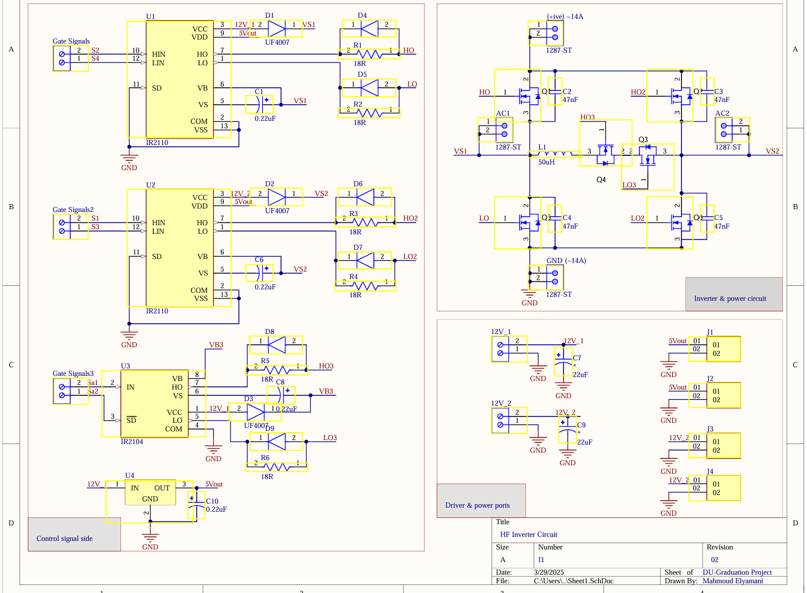
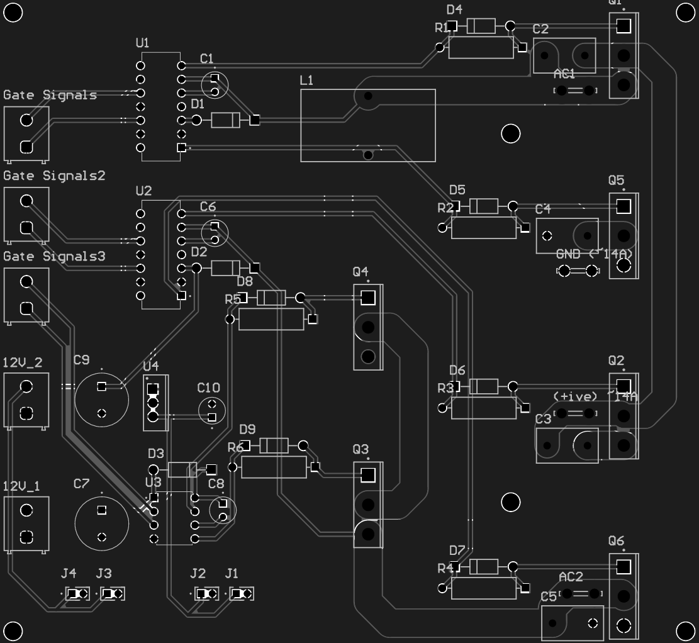

# Power Electronics — Altium PCB Designs

The power stage is split across custom boards designed in Altium Designer, covering line-side conditioning, the high-frequency inverter that drives the transmitter coil, secondary-side rectification, and switch protection.

## 1. Input Rectifier & EMI Filter Board

Converts incoming 220 V AC to a filtered DC bus for the rest of the system. A common-mode choke (L1/L2) with X-capacitors (C1–C8, 47 nF) on both input lines suppresses conducted EMI before the bridge rectifier (D1, GBJ2506). The rectified output is smoothed by four 450 V reservoir capacitors (C9–C12), with a bleeder resistor (R1, 220 kΩ) to safely discharge the bus when powered down.

## 2. Secondary-Side (Receiver) Rectifier Board

Rectifies the high-frequency AC received across the coupled coils (`ACHF1`/`ACHF2`) back to DC on the receiver side, using four SiC Schottky diodes (C3D06060A) in a bridge configuration — chosen for their fast recovery at the system's 83.5 kHz operating frequency, where standard silicon diodes would introduce excessive switching losses. Output ripple is smoothed by three parallel DC-link capacitors (C1–C3).

## 3. HF Inverter Driver & Power Board

This is the H-bridge switching stage that generates the high-frequency drive signal for the transmitter coil. Two IR2110 half-bridge gate drivers (U1, U2) handle the main bridge legs, with bootstrap diodes (UF4007) and gate resistors (18 Ω) shaping the switching edges into the SiC power MOSFET footprints (Q1–Q6). A third IR2104 driver (U3) is included for an additional leg. An onboard 12 V→5 V regulator (U4) supplies clean logic-level power to the driver ICs, and dedicated connectors bring in the gate signals generated by the STM32 controller as well as the 12 V rails and high-current AC/DC power connections.

---

## Bill of Materials

The full BOM, broken down per board and matching the production-cost breakdown in the project book, lives at [`WPT Project Core Cost.pdf`](WPT%20Project%20Core%20Cost.pdf):
