# Resonant Inductive Wireless EV Charger — 823W Prototype

> A practical 1kW-class resonant inductive wireless power transfer (WPT) prototype for EV charging, using square-shaped Litz-wire coils and SS compensation. Delivers **823 W DC** at **77.5% efficiency** across a **15 cm air gap**, compliant with the **SAE J2954** international WPT standard.

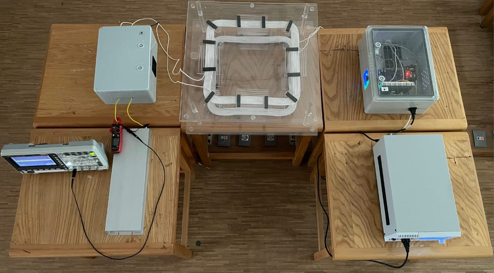

> Full Power System Model
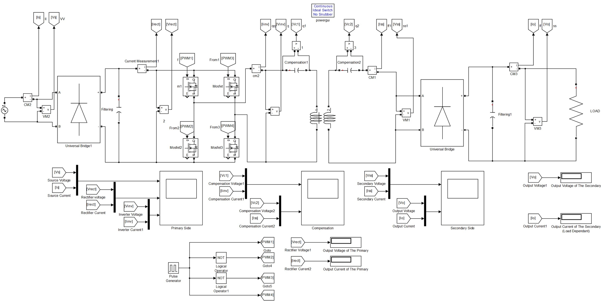

> Result showcase and output
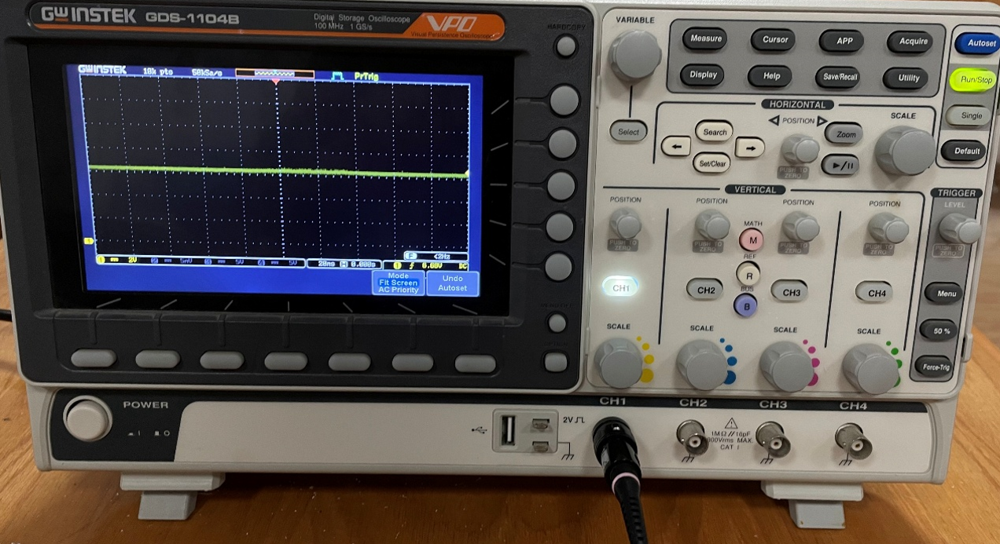
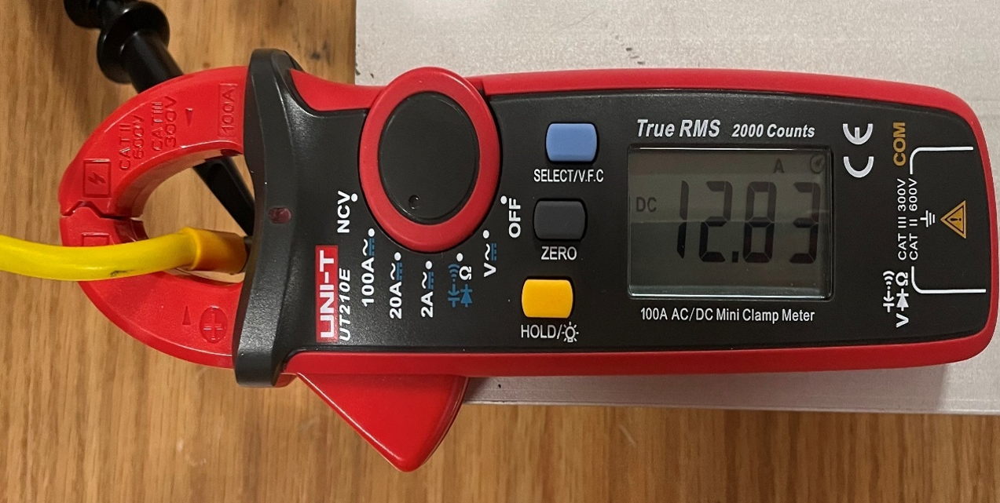

---

## 📚 Documentation

- [Virtual & Physical output Results (MATLAB)](Results)
- [Electromagnetic Simulation (Ansys Maxwell)](Electromagnetics)
- [WPT Coil Design (AutoCAD)](WPT%20Coil%20design)
- [System Modeling (MATLAB/Simulink)](System%20Modeling)
- [Power Electronics (Altium, SiC H-bridge)](docs/power-electronics.md)
- [Embedded Control (STM32)/(Atmega328)](Firmware)
- [Full Project Book (PDF)](docs/project-book.pdf) 

---

## System Specifications and technical Information

| | |
|---|---|
| **Output Power** | 823 W DC (aligned, 15 cm air gap) |
| **Measured Efficiency** | 77.5% |
| **Compensation Topology** | Series-Series (SS) |
| **Resonant Frequency** | 83.5 kHz — SAE J2954 Z-class compliant |
| **Coils** | 45 × 45 cm square, Litz wire, ferrite (PC40) backed |
| **Switching Devices** | SiC MOSFETs (1200 V), H-bridge inverter |
| **Gate Drive / Isolation** | IR2110 gate driver + 6N135 optocoupler |
| **MCU** | STM32F401RCT6 (84 MHz Cortex-M4) |
| **Tools** | MATLAB/Simulink, Ansys Maxwell 3D + Simplorer, Altium Designer, STM32CubeIDE |

---

## Main Idea and Theory Behind the Project

Electric vehicle wireless charging works by transferring power across an air gap using magnetically coupled resonant coils instead of a physical cable. This project designs, simulates, and physically builds a working 1kW-class version of that system: a high-frequency inverter drives a transmitting coil, energy couples across the air gap to a receiving coil tuned to the same resonant frequency, and the received AC is rectified back to usable DC power. The design was validated in three independent ways — hand-derived circuit equations, Ansys Maxwell 3D electromagnetic field simulation, and MATLAB/Simulink system modeling — before being built and measured on the bench.

> Electromagnetic field Simulation on Ansys
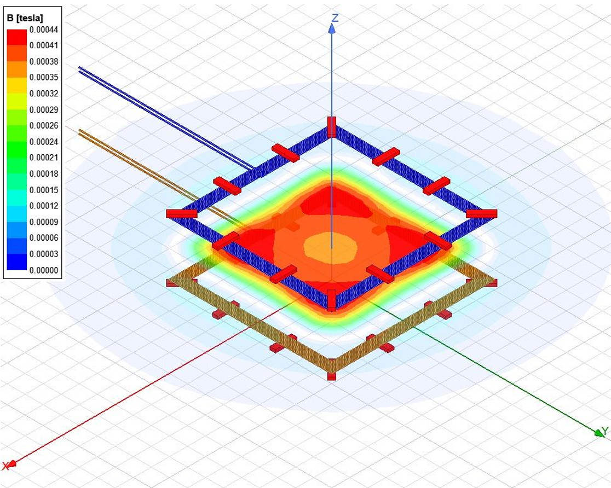
*The chosen coil topology with the mentioned input power, field intensity differs with the color legend.*

The system was tested across **52 distinct misalignment positions** (horizontal, vertical, and combined/rotational) to characterize how coupling coefficient and efficiency degrade as the vehicle's receiver coil drifts out of alignment with the ground pad — a real-world condition any production wireless charger has to tolerate.

## 🗺️ Design & Topology Selection Process

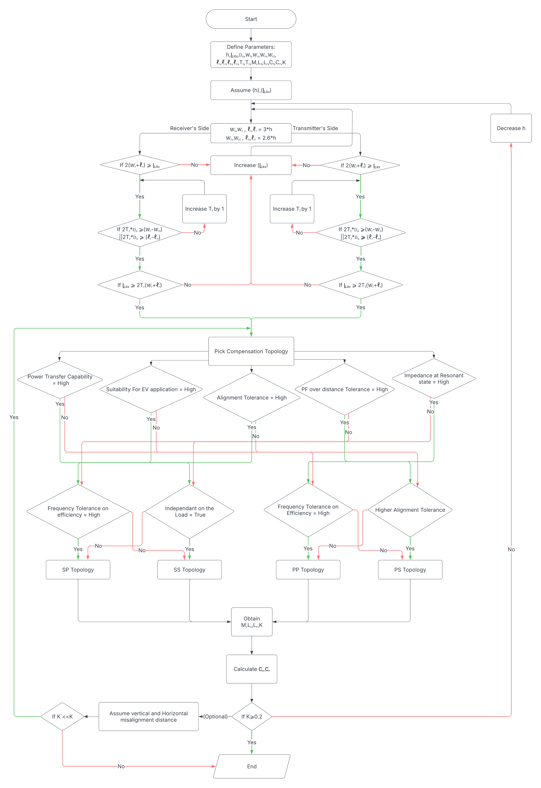
*The algorithm used to size the coil windings (turns, Litz wire length) and select a compensation topology (SS/SP/PP/PS) based on required power capability, alignment tolerance, and frequency sensitivity. SS was ultimately selected for its independent capacitor sizing, stable voltage-source characteristics, and built-in short-circuit protection.*

Full derivation of the governing equations (coupling coefficient, mutual inductance, resonant condition, SS-topology efficiency) is in [`docs/methodology.md`](docs/methodology.md).

---

## 📊 Key Results

> Output Graph Results on Ansys
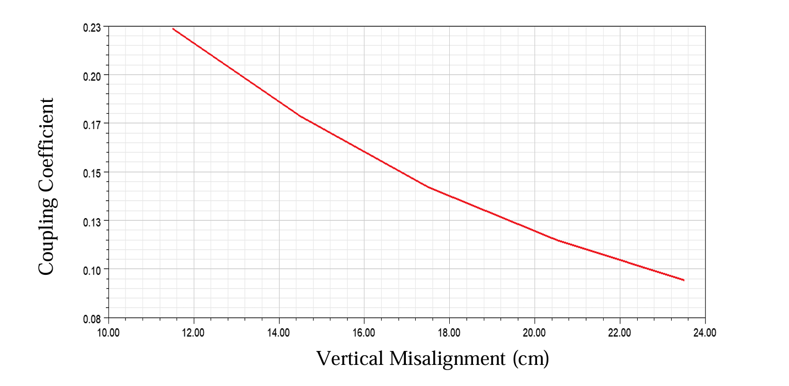
*relationship between vertical misalignment in Z-axis and coupling coefficient.*

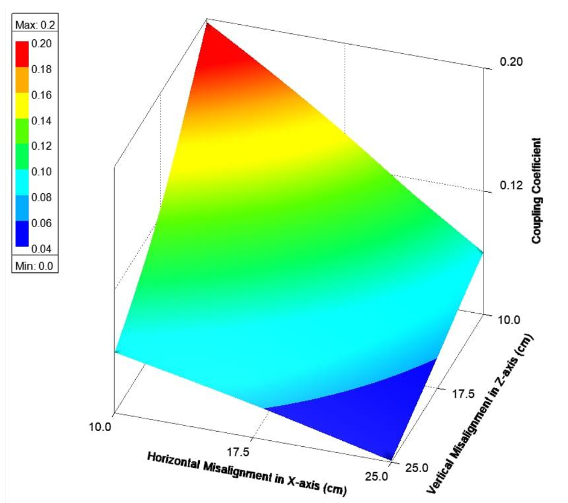
*relationship between horizontal misalignment in X-axis, vertical misalignment in Z-axis and coupling coefficient*

> Coupling coefficient vs misalignment
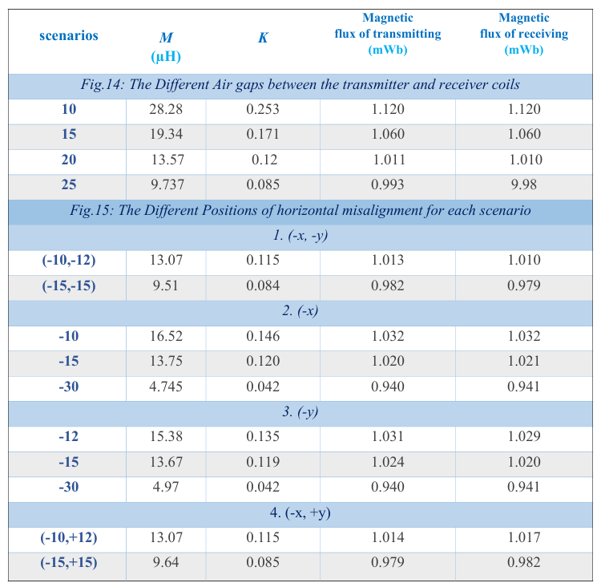
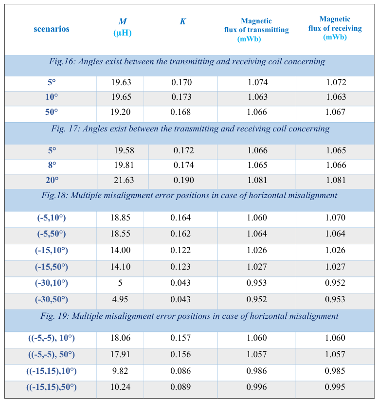
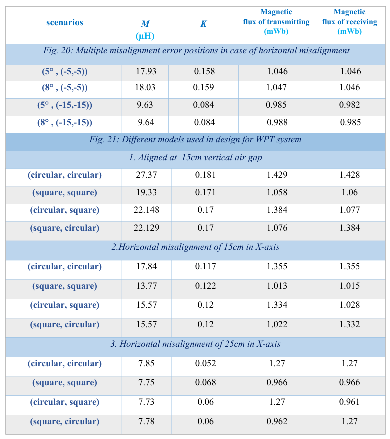
*Coupling coefficient (K) vs. horizontal/vertical coil misalignment across 52 tested positions*

> Output Graph Results on Ansys
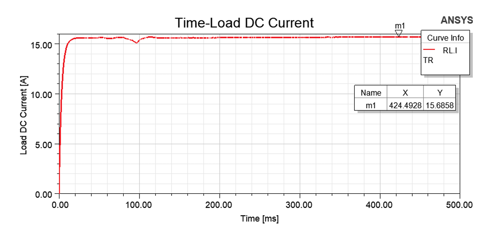
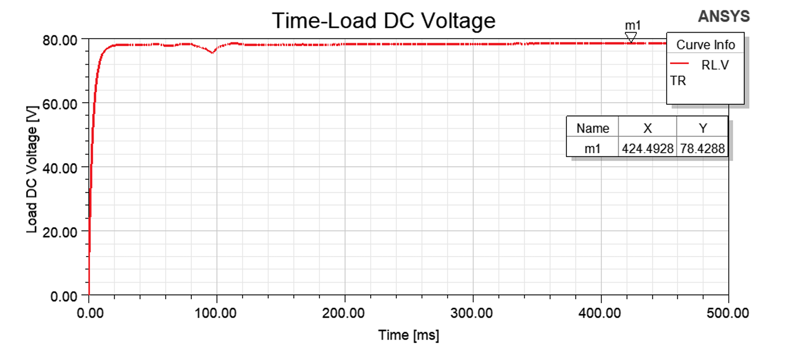
*Current over time and voltage over time output result graphs on simulation*

> Output power relation with operating frequency change
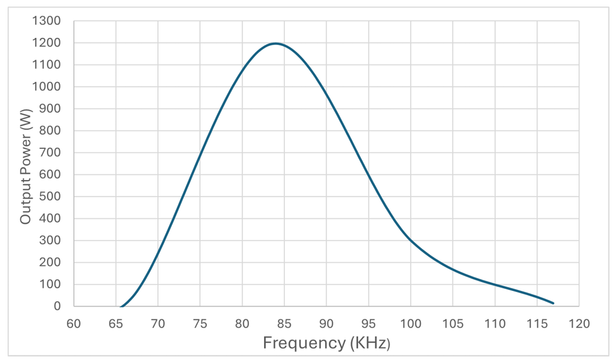
*The output power peaks at the resonant frequency range then starts dimming again due to being out of resonance*

> Efficiency relation with operating frequency change
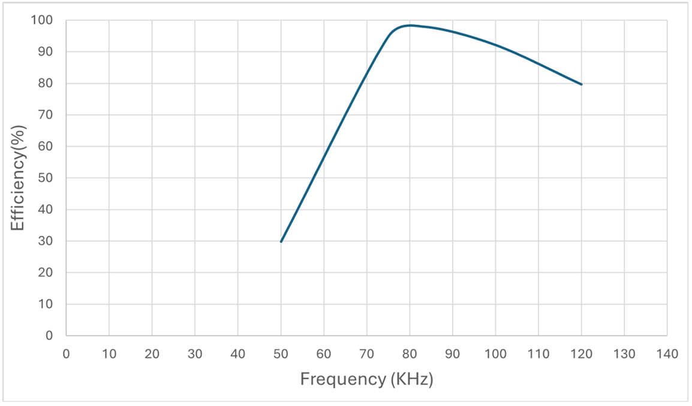
*The efficiency peaks at the resonant frequency range then starts dimming again due to being out of resonance*

> Virtual vs Actual values comparison
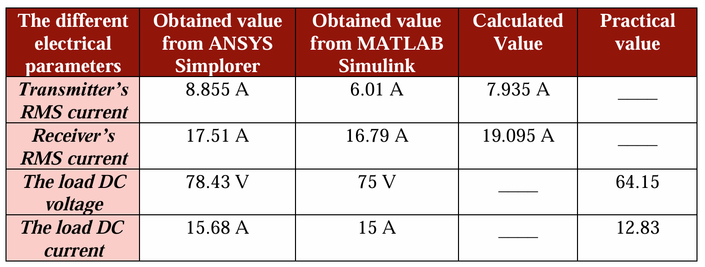
*Measured vs. theoretical efficiency: 77.5% practical vs. 98.21% ideal (MATLAB model, no magnetic/switching losses) — the gap that comes from real-world loss mechanisms not captured in the ideal model*

---

## 🧪 Skills Demonstrated

- Resonant power converter design and compensation topology trade-off analysis (SS vs. SP vs. PP vs. PS)
- Electromagnetic field simulation and coil optimization under misalignment (Ansys Maxwell 3D)
- High-frequency, high-voltage PCB design for a SiC H-bridge inverter (Altium Designer)
- Gate-drive and galvanic isolation design (IR2110, 6N135 optocoupler)
- Embedded firmware for real-time high-frequency PWM generation (STM32CubeIDE, C)
- System-level modeling and cross-validation against theory and simulation (MATLAB/Simulink)
- Standards compliance (SAE J2954)

## ⚠️ Known Limitations

Documented transparently in the project book's conclusion: implementation cost, component weight/size constraints, sensitivity to magnetic interference and temperature, limited operating range, and the practical-vs-ideal efficiency gap (77.5% measured vs. 98.21% theoretical, the difference coming from magnetic and switching losses not captured in the ideal MATLAB model).

## 👥 Team & Acknowledgments

Mahmoud Hisham Elyamani, Walid Salah Gebril, Mohamed Atef Ameen, Ezzeldin Ali Khedr, Mohamed Tarek Ouf, Manar Dawoud Mohammed, Eslam Ayman Badawy, Zeinab Elsayed Abdelbasset — B.Sc., Electrical Power and Machines Department, Faculty of Engineering, Damietta University (2024–2025).

Supervised by Dr. Mohamed Osman Atallah.
