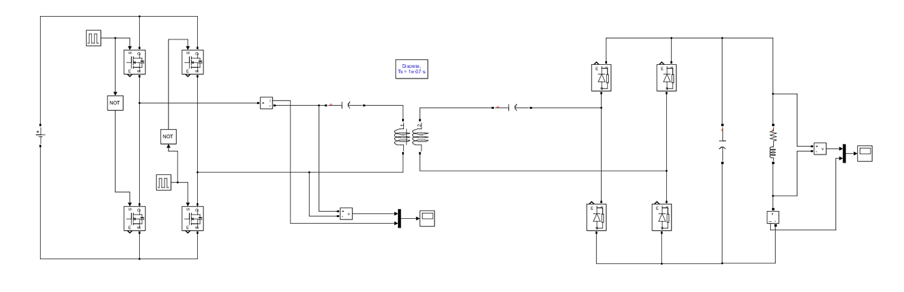
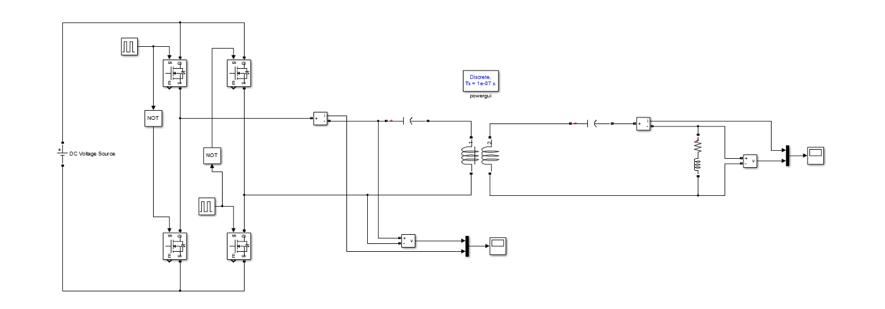
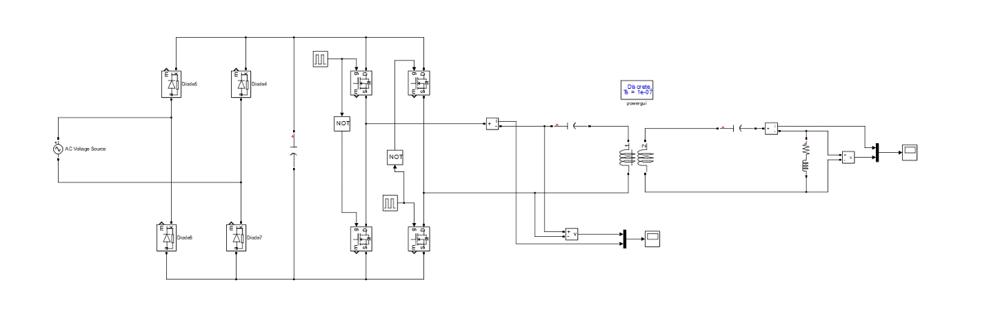
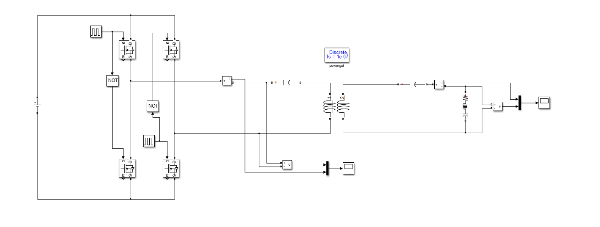
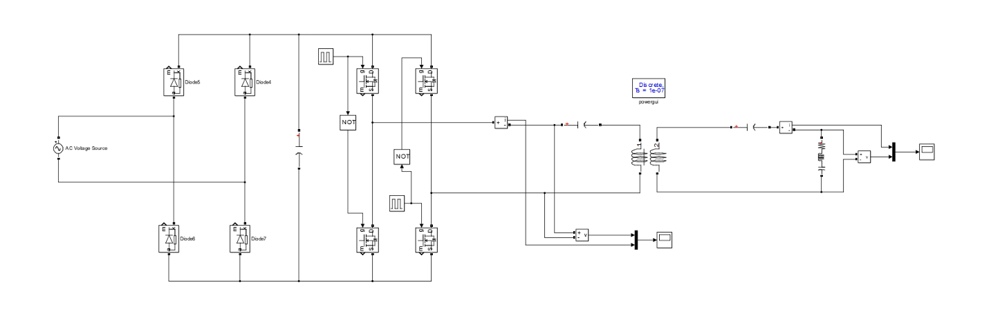

# Load Characterization — Input Voltage vs. Output Power

Beyond validating the resonant link itself, we wanted to understand how the system's output scales with input voltage under different load and rectification arrangements — both to sanity-check the model against bench data, and to understand what happens if a rectifier stage ever fails in the field. This study was run purely in **MATLAB**, not Ansys Simplorer, since MATLAB solves switching power-electronics models (diodes, MOSFETs) noticeably faster.

All results below use the same fixed system parameters, derived from the mutual inductance value that gave the best convergence between simulation and practical results:

| f (kHz) | h (cm) | M (µH) | Rₜ (Ω) | Rᵣ (Ω) | Lₜ (µH) | Lᵣ (µH) | Cₜ (nF) | Cᵣ (nF) | R_L (Ω) | L_L (µH) |
|---|---|---|---|---|---|---|---|---|---|---|
| 83.3 | 15 | 23.47 | 0.1 | 0.1 | 100 | 100 | 36.5 | 36.5 | 5.8 | 20.5 |

Three load configurations were tested, each fed two different ways: directly from a DC source into the inverter (representing a lab bench supply), or from an AC source through an input rectifier ahead of the inverter (representing grid power).

## Case 1 — RL Load, With Secondary Rectification

This is the configuration closest to the real target application: the receiver's AC output is rectified to DC before reaching the load.

**Low-voltage sweep (simulation vs. practical):**

| i/p V_dc (V) | Iₜ RMS (A) sim | Iₜ RMS (A) practical | o/p V_dc (V) sim | o/p V_dc (V) practical | o/p I_dc (A) sim | o/p I_dc (A) practical | o/p P_dc (W) sim |
|---|---|---|---|---|---|---|---|
| 10 | 0.403 | 0.34 | 3.721 | 2.2 | 0.642 | 0.66 | 2.388 |
| 20 | 0.671 | 0.61 | 7.476 | 5.5 | 1.289 | 1.2 | 9.636 |
| 30 | 0.954 | 0.87 | 11.233 | 8.5 | 1.936 | 1.75 | 21.747 |
| 40 | 1.237 | 1.12 | 14.981 | 10 | 2.584 | 2.26 | 38.718 |
| 50 | 1.555 | 1.4 | 18.744 | 14 | 3.232 | 2.8 | 60.580 |
| 60 | 1.909 | 1.63 | 22.499 | 17 | 3.879 | 3.35 | 87.273 |

At 220 V input (simulation only — the maximum our lab supply could provide):

| i/p V_dc (V) | Iₜ RMS (A) | o/p V_dc (V) | o/p I_dc (A) | o/p P_dc (W) |
|---|---|---|---|---|
| 220 | 6.576 | 82.591 | 14.239 | 1176.013 |

This result flagged a real hardware constraint: the rectifier diodes we had on hand at the time were rated for 15 A but safe to run at roughly 10 A continuous, while the simulated output current at 220 V input is 14.24 A — enough to damage them. This is why the BOM was later updated to higher-current-rated diodes for the final build.

Feeding the same load configuration from 220 V AC through an input rectifier instead gives a higher output, since two rectification stages are now involved:

| i/p V_ac RMS (V) | Iₜ RMS (A) | o/p V_dc (V) | o/p I_dc (A) | o/p P_dc (W) |
|---|---|---|---|---|
| 220 | 8.485 | 112.05 | 19.32 | 2164.806 |

## Case 2 — RL Load, No Secondary Rectification

This case leaves the receiver's output as raw AC — useful for understanding system behavior if the secondary rectifier were to fail, since the load would then have to tolerate AC directly instead of DC.

**Low-voltage sweep:**

| i/p V_dc (V) | Iₜ RMS (A) sim | Iₜ RMS (A) practical | o/p V_ac RMS (V) sim | o/p V_ac RMS (V) practical | o/p I_ac RMS (A) sim | o/p I_ac RMS (A) practical | o/p P_ac (VA) sim | o/p P_ac (VA) practical |
|---|---|---|---|---|---|---|---|---|
| 10 | 0.75 | 0.51 | 8.84 | 6.364 | 0.707 | 0.5 | 6.25 | 3.182 |
| 20 | 1.49 | 1.01 | 17.68 | 14.14 | 1.414 | 1.15 | 25 | 16.261 |
| 30 | 2.25 | 1.51 | 26.16 | 19.8 | 2.12 | 1.7 | 55.46 | 33.66 |
| 40 | 3 | 2 | 35.36 | 28.28 | 2.83 | 2.25 | 100.06 | 63.63 |
| 50 | 3.75 | 2.55 | 44.55 | 35.35 | 3.54 | 2.77 | 157.7 | 97.92 |
| 60 | 4.5 | 3.02 | 53.033 | 42.42 | 4.38 | 3.2 | 232.28 | 135.74 |

Because there's no rectifier smoothing the output, and the load's inductance is significant at 83 kHz, these results are reported as **apparent power (VA)** rather than active power.

At 220 V, DC-fed:

| i/p V_dc (V) | Iₜ RMS (A) | o/p V_ac RMS (V) | o/p I_ac RMS (A) | o/p P_ac (VA) |
|---|---|---|---|---|
| 220 | 16.4 | 195.87 | 15.98 | 3130 |

At 220 V AC (through an input rectifier, i.e. two-stage rectification with an unrectified output):

| i/p V_ac RMS (V) | Iₜ RMS (A) | o/p V_ac RMS (V) | o/p I_ac RMS (A) | o/p P_ac (VA) |
|---|---|---|---|---|
| 220 | 22.06 | 265.518 | 21.36 | 5671.46 |

## Case 3 — RLC Load, No Rectification

Since Case 2 showed the output dominated by reactive rather than active power, a series capacitor was added to the load and tuned via the resonance condition — calculated at **178 nF** — to cancel out the load's inductive reactance.

**Low-voltage sweep (simulation only — practical testing pending at time of writing):**

| i/p V_dc (V) | Iₜ RMS (A) sim | o/p V_ac RMS (V) sim | o/p I_ac RMS (A) sim | o/p P_ac (W) sim |
|---|---|---|---|---|
| 10 | 0.353 | 4.384 | 0.707 | 3.1 |
| 20 | 0.707 | 8.838 | 1.414 | 12.497 |
| 30 | 1.06 | 13.435 | 2.121 | 28.495 |
| 40 | 1.414 | 17.677 | 2.828 | 49.99 |
| 50 | 1.767 | 21.92 | 3.535 | 77.487 |
| 60 | 2.121 | 26.516 | 4.242 | 112.48 |

With the reactance cancelled, this case reports **active power (W)** rather than apparent power.

At 220 V DC:

| i/p V_dc (V) | Iₜ RMS (A) | o/p V_ac RMS (V) | o/p I_ac RMS (A) | o/p P_ac (W) |
|---|---|---|---|---|
| 220 | 7.778 | 98.287 | 15.73 | 1546.054 |

At 220 V AC (through an input rectifier):

| i/p V_ac RMS (V) | Iₜ RMS (A) | o/p V_ac RMS (V) | o/p I_ac RMS (A) | o/p P_ac (W) |
|---|---|---|---|---|
| 220 | 10.253 | 130.107 | 21.213 | 2759.96 |

## Benchmarking Against the Literature

To put the ~1 kW target in context, we compared it against published WPT prototypes reporting power levels in a similar range:

| Reference power (kW) | Number of papers at this level |
|---|---|
| 1 | 2 papers |
| 0.5 | 2 papers |
| 0.15 | 1 paper |
| 1.2 | 1 paper |
| 0.2 | 1 paper |
| 2.6 | 1 paper |
| 0.322 | 1 paper |
| 1.949 | 1 paper |

## Notes & Takeaways

- The gap between simulation and practical results across every table above comes down to the inverter not being 100% efficient in practice — the simulated switches are ideal, the real ones aren't.
- The no-rectification cases (2 and 3) weren't just academic: they model what happens if the secondary rectifier fails in operation, so the system's behavior in that state is understood ahead of time rather than discovered during a fault.
- The 220 V results across all cases are simulation figures — our lab supply's practical ceiling — used to project how the system behaves as it scales toward its full-power operating point.

---
*Prepared by Walid Salah Gebril and Mohamed Tarek Ouf, reviewed by Mahmoud Hesham Elyamani and Mohamed Atef Farah, under the supervision of Dr. Mohamed Osman Atallah.*
