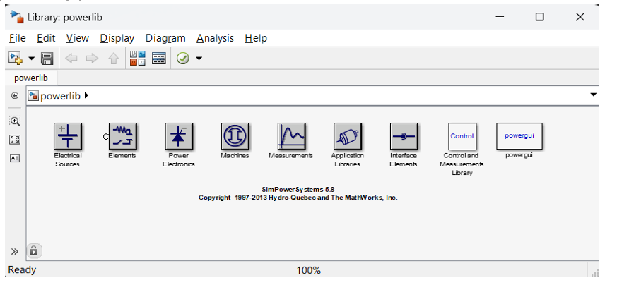
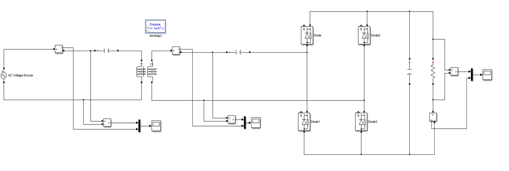
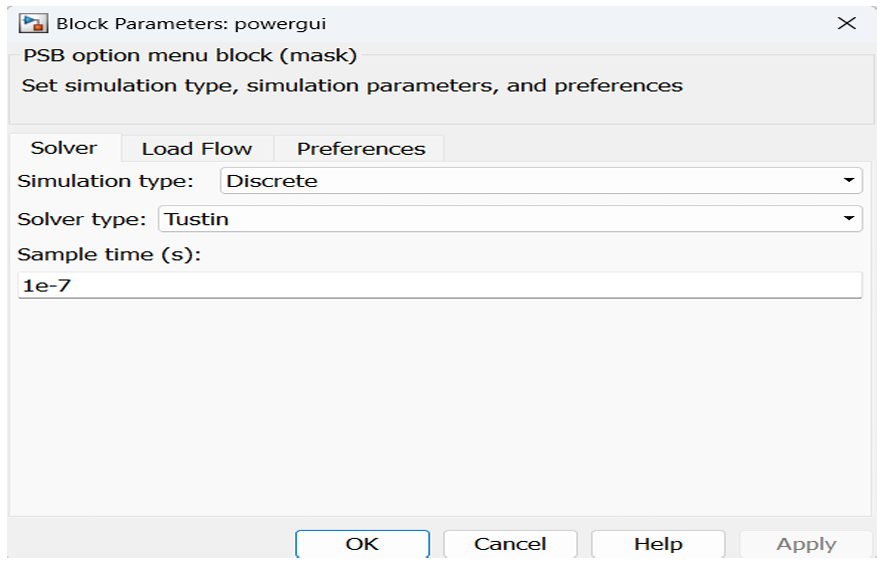
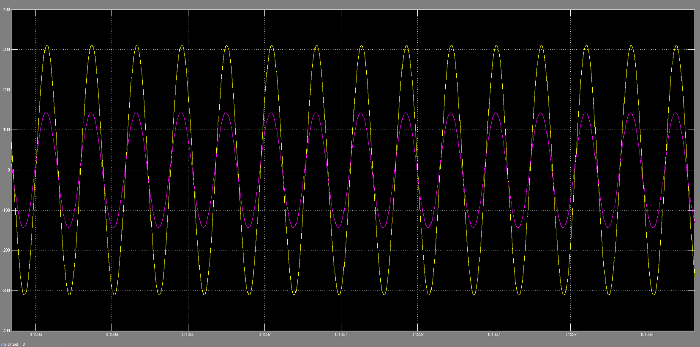
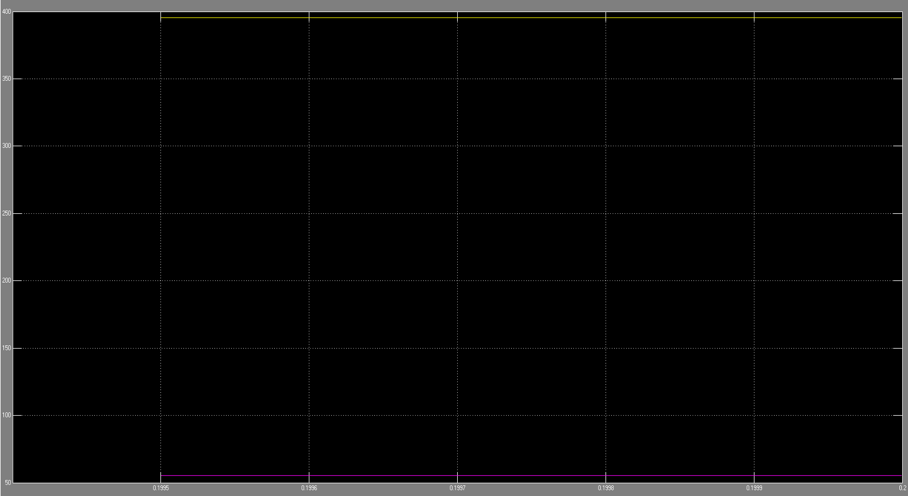
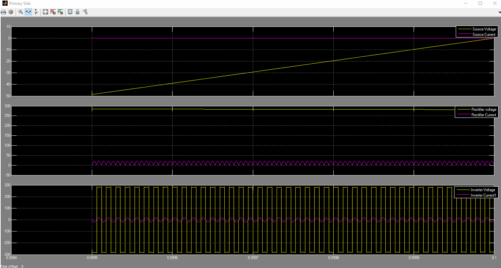
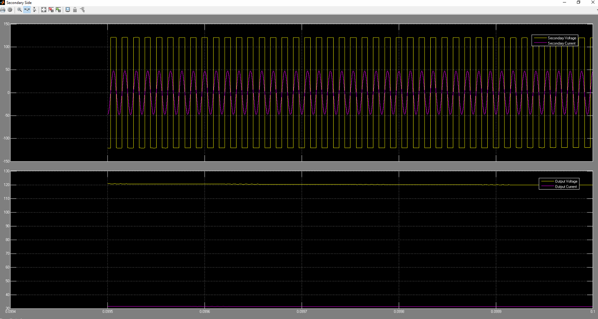

# System Modeling — MATLAB/Simulink

Before committing to hardware, the full power stage was modeled in MATLAB/Simulink to confirm the electrical behavior of the resonant link — inverter switching, resonant tank tuning, and rectification — independently of the electromagnetic (Ansys Maxwell) simulation. The two were later cross-checked against each other and against bench measurements.

## Tooling

The model is built entirely from the Simscape **Power Systems** library (`powerlib`, formerly SimPowerSystems), which provides ready-made electrical source, switching device, and measurement blocks.

## Building the Base Circuit

The first version of the model was intentionally minimal: an AC source feeding the resonant coil pair through a switching bridge, with a diode rectifier and resistive load on the output. This let the resonant behavior be verified in isolation before adding the rest of the power chain.

One setting matters a lot here: the solver has to run in **Discrete** mode (Tustin) rather than continuous, since the circuit involves fast switching transitions. The sample time was set to `1e-7 s`, following the rule of thumb that the discrete sample time should be at most ~10% of the switching period.

### Resonance Verification

With the base circuit running, the first thing to check is whether the tank is actually operating at resonance — which shows up as the primary voltage and current being in phase.

*Primary voltage and current in phase — confirms the resonant condition.*

*Output voltage and current delivered to the load.*

## Expanding to the Full Model

Once the simplified circuit confirmed correct resonant behavior, it was extended into a complete system model that mirrors the real power chain: an AC grid source feeds a rectifier, which feeds the high-frequency inverter (an H-bridge switched by a pulse generator through complementary logic gates), through the primary compensation network, across the coupled coils, through the secondary compensation network, into a secondary rectifier, output filter, and finally the load.

Voltage and current measurement blocks are placed on both the primary and secondary sides, feeding dedicated scopes ("Primary Side" and "Secondary Side"), so parameters can be swept and results monitored without having to rebuild the circuit each time.

*Primary side: source, rectifier, and inverter voltage/current.*

*Secondary side: coil output and load voltage/current.*

## Example Readings

The graph below shows one example set of readings pulled from the model during development:

| Quantity | Value |
|---|---|
| Output Voltage of the Primary | 281.3 V |
| Output Current of the Primary | 1.677 A |
| Output Voltage of the Secondary | 119.8 V |
| Output Current of the Secondary (load dependent) | 31.18 A |

> **Note:** these particular numbers were captured during model development/testing and are **not** the final prototype's operating point — see [`docs/methodology.md`](Results) and the main [README](../README.md) for the validated final results (823 W, 77.5% efficiency).
